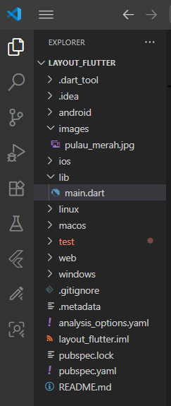

# layout_flutter

# Praktikum 1: Membangun Layout di Flutter

Code pada praktikum 1, membuat layout di flutter

# Praktikum 2: Implementasi button row

Code pada praktikum 2, mengimplementasikan button row di flutter

# Praktikum 3: Implementasi text section

Code pada praktikum 3, mengimplementasikan  text section

# Praktikum 4: Implementasi image section

Code pada praktikum 4, mengimplementasikan image section

# Hasil Akhir Praktikum Basic Layout Flutter

Screenshot hasil akhir menggunakan android studio

Terimakasih

